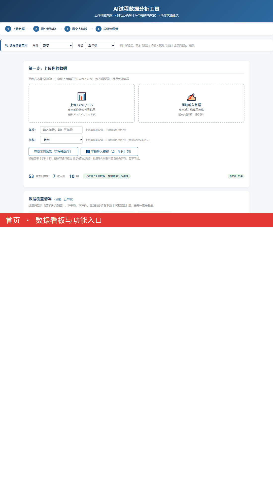

# 小学社群运营 · 过程数据分析平台（AI 驱动）

一个面向社群运营的过程数据分析工具：把每期运营产生的过程数据（到课率、转化率等）变成可复盘、可诊断、可预测的闭环，让运营从"凭经验拍脑袋"变成"看数据补短板"。前端用 Flask 渲染，后端用 pandas / statsmodels 做分析，并接入 DeepSeek 自动产出复盘建议。

> 定位：把「社群运营业务」和「数据分析 / AI」结合。适合作为全栈 + 业务理解能力的作品集。

---

## 功能模块

| 模块 | 说明 |
|---|---|
| 个人环比复盘 | 每期自动对比本人上一期数据，弱化指标标红，直接指出下期发力点 |
| 团队复盘 | 看团队整体过程数据走势 |
| 个人诊断 | 同期同组对比，看清自己在团队里的位置 |
| 转化率预测 | 个人历史近邻法（KNN）预测 Day3 / 最终转化率；按真实漏斗口径（Day3 ≤ 最终） |
| AI 复盘结论 | 接入 DeepSeek，结合团队沉淀的 SOP 方案，自动产出下期行动清单 + 延展思路 |
| 数据上传 / 查看 | 按模板批量导入，年级 / 学科唯一性校验防止多人录入串数据 |

**核心设计取舍**
- 复盘只做「这期 vs 上期」，不展示整期均值（均值对运营无意义）。
- 杠杆模型（回归）只用来给过程指标排优先级，不展示 p 值 / R² 等术语。
- 识别不可控变量（如好友率由前端 BD 引流决定），不把它列为可优化短板。
- Day3 出直播间转化率与最终续报率同口径、Day3 ≤ 最终，预测不乱给反号结果。

---

## 技术栈

Python · Flask · SQLite · pandas · numpy · statsmodels · DeepSeek API · 原生前端

---

## 目录结构

```
platform/
├── app.py                 # Flask 后端：路由 + 分析逻辑
├── templates/index.html   # 前端页面
├── data.db                # SQLite 数据库（开源版不含真实业务数据，需自行导入）
├── materials/             # 物料（思维卡图、主讲资质图等）
├── config.json            # 编辑口令哈希（已被 .gitignore 排除）
├── ai_config.json         # DeepSeek 配置（已被 .gitignore 排除，见下方配置）
├── requirements.txt
├── .gitignore
└── 网站演示.gif            # 功能演示
```

---

## 快速开始

```bash
# 1. 安装依赖
pip install -r requirements.txt

# 2. 配置 AI（可选，不配也能跑，只是没有 AI 复盘结论）
#    复制 ai_config.example.json 为 ai_config.json，填入你的 DeepSeek key
cp ai_config.example.json ai_config.json
#    编辑 ai_config.json，把 deepseek_key 改成你自己的

# 3. 启动
python app.py
#    默认监听 http://127.0.0.1:5000
```

---

## 数据说明

- 开源仓库**不含真实业务数据**。首次运行会生成空库，需在页面「数据上传」按模板导入。
- 导入模板表头（CSV）：
  `期次,姓名,学科,年级,好友率,入群率,APP下载率,开营回复率,Day1到课率,Day3出直播间转化率,最终转化率`
- 率字段为百分比数值（如 52 表示 52%）。
- 同名同人（同姓名 + 同学科）在库里只能有一个年级，跨年级或空年级会被拦截。

---

## 演示



---

## 免责声明

本项目为个人实习作品，所用数据均经过脱敏处理，仅用于展示架构与分析思路，不含真实用户信息。
